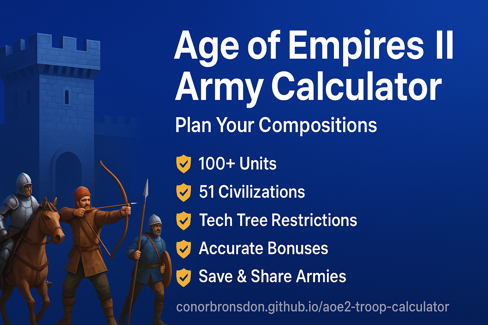

<div align="center">

# Age of Empires II: Army Composition & Cost Calculator

### 🏰 Plan Your Armies Like a Pro • No Excel Needed 🏰

[](https://conorbronsdon.github.io/aoe2-troop-calculator/)
[](https://github.com/conorbronsdon/aoe2-troop-calculator)
[](https://www.xbox.com/en-US/developers/rules)

**A comprehensive web-based cost calculator for planning army compositions in Age of Empires II: Definitive Edition**

Plan your armies • Calculate costs • Compare civilizations • Optimize resources • Track bonuses



---

💡 **Inspired by pro players** ([Hera vs. Lewis](https://youtu.be/6WyRs7SY0Tk?si=RHdJiWtagC0ZG1rA)) using Excel sheets for 200 unit battles.

</div>

---

## 📋 Table of Contents

- [✨ Features](#-features)
- [📖 How to Use](#-how-to-use)
- [🚀 Development](#-development)
- [🧪 Testing](#-testing)
- [📊 Data Accuracy](#-data-accuracy)
- [🎨 Asset Resources](#-asset-resources)
- [🎯 Roadmap](#-roadmap)
- [🙏 Credits](#-credits)
- [📚 Documentation](#-documentation)
- [🐛 Support & Feedback](#-support--feedback)

---

## ✨ Features

### 🎮 Complete Unit Roster (100+ Units)
- **Infantry** (12 units): Militia → Man-at-Arms → Longswordsman → Two-Handed Swordsman → Champion
  - Spearman → Pikeman → Halberdier
  - Eagle Scout → Eagle Warrior → Elite Eagle Warrior
- **Cavalry** (15 units): Scout → Light Cavalry → Hussar
  - Knight → Cavalier → Paladin
  - Camel Rider → Heavy Camel → Imperial Camel
  - Battle Elephant line, Steppe Lancer line
- **Archers** (13 units): Archer → Crossbowman → Arbalester
  - Skirmisher → Elite Skirmisher → Imperial Skirmisher
  - Cavalry Archer → Heavy Cavalry Archer
  - Hand Cannoneer, Slinger, Genitour line
- **Siege** (11 units): Ram → Capped Ram → Siege Ram
  - Mangonel → Onager → Siege Onager
  - Scorpion → Heavy Scorpion
  - Bombard Cannon, Trebuchet, Petard
- **Naval** (14 units): Galley → War Galley → Galleon
  - Fire Ship line, Demolition Ship line, Cannon Galleon line
  - Transport Ships, Trade Cogs, Fishing Ships
- **Monks** (2 units): Monk, Missionary
- **Unique Units** (50+ civilization-specific units)

### 🏛️ Civilization Features
- **51 Civilizations** from all regions (European, Asian, African, American, Middle Eastern)
- **Technology Tree Restrictions**: Units filtered by civilization-specific tech tree
  - Aztecs/Mayans/Incas cannot build cavalry (historically accurate)
  - Vikings restricted from cavalry units
  - Each civ shows only units they can actually build
- **Unique Units System**: Each civ's unique units automatically available when selected
  - Britons: Longbowman, Spanish: Conquistador, Goths: Huskarl, and 40+ more
- **Comprehensive Bonuses**:
  - 💰 **Cost Reduction Bonuses**: Automatic price adjustments (Mayans archers, Goths infantry, etc.)
  - ⚔️ **Military Bonuses**: HP, attack, armor, range improvements (Franks cavalry HP, Britons archer range)
  - 🌾 **Economic Bonuses**: Resource gathering, building costs, age advancement bonuses
  - 🤝 **Team Bonuses**: Allied team benefits displayed
- **Interactive Bonus Panel**: Expanded by default showing all active bonuses by category
- **Consolidated Civilization Display** (NEW in v2.5.0):
  - Prominent civilization insignia (64x64 icon) in bonuses header
  - Region-specific color coding (European=blue, Asian=red, African=orange, etc.)
  - "ACTIVE" badge for clear status indication
  - Streamlined indicator (only shows for generic or preview mode)
  - Quick bonus summary showing Military/Economic/Cost counts inline

### 🎯 Army Planning Tools
- **Custom Resource Limits**: Set available food, wood, gold, and stone
- **Population Cap Control**: Adjust from 200 to custom values
- **Age Selection**: Dark, Feudal, Castle, and Imperial Age filtering
- **Flexible Display Modes**: Choose what to display for optimal planning
  - ⚔️ **Units Only**: Focus on military unit composition
  - ⚔️🏰 **Units & Fortifications**: Plan comprehensive offense and defense strategies
  - 🏰 **Fortifications Only**: Focus on defensive structures (walls, gates, towers, castles)
  - Track stone requirements for fortifications
  - Unified resource tracking across all selections
- **Real-Time Tracking**: Live resource and population counters with visual progress bars
- **Visual Feedback**: Green/yellow/red progress bars based on resource usage
- **Discount Display**: Shows both discounted and original prices when bonuses apply
- **Compact Resource Bar**: Fixed bottom bar showing totals while scrolling through army compositions

### 📊 Enhanced Resource Tracker (NEW in v2.5.0)
- **Gradient Progress Bars**: Resource-specific colors with visual depth
  - 🍖 Food: Orange to red gradient
  - 🪵 Wood: Amber gradient
  - 🪙 Gold: Yellow gradient
  - 🪨 Stone: Gray gradient
  - 👥 Population: Purple gradient
- **Status Indicators**: Dynamic icons showing resource status
  - ✅ Good (under 50%)
  - 📈 Moderate (50-80%)
  - 📊 High (80-95%)
  - ⚠️ Critical (95-100%)
  - 🚫 Over Limit
- **Animated Transitions**: Smooth 500ms animations when values change
- **Pulse Effects**: Visual alert when approaching or exceeding limits
- **Fixed Bottom Bar**: Track totals while scrolling through large armies

### 💾 Composition Management
- **Save/Load System**: Store multiple army compositions locally
- **Export to JSON**: Download your compositions for sharing
- **Import Compositions** (NEW in v2.6.0):
  - 📤 Import from JSON files via drag-and-drop or file browser
  - 📋 Paste JSON or encoded army data directly
  - 🔗 Import from shared URLs with army parameters
  - ⚙️ Choose to Replace or Merge with current composition
  - ✅ Full validation with error and warning messages
  - 🔒 Data sanitization for security (XSS protection)
  - 📊 Import history tracking with statistics
- **URL Sharing**: Share compositions via link
- **Comparison Mode**: Compare two different civilizations side-by-side

### 🔍 Unit Search & Filter System
- **Search Bar**: Find units instantly by typing their name
- **Category Filters**: Toggle Infantry, Cavalry, Archers, Siege, Naval, Unique, Other
- **Cost Filters**: Filter by Trash units (no gold), Gold units, or Low cost (<100 total)
- **Age Filters**: Show only units from specific ages
- **Real-Time Results**: See matching unit count as you filter
- **Clear Filters**: One-click reset for all filters
- **Mobile Friendly**: Responsive filter UI on all devices

### 🎯 Unit Counter Visualization
- **Counter Badges**: Each unit card shows "Strong Against" and "Weak To" relationships
- **Color-Coded**: Green badges for counters, red for weaknesses
- **Collapsible Info**: Expand/collapse to save space
- **Tooltips**: Additional context on hover
- **Strategic Planning**: Build balanced compositions by understanding counter relationships

### 📱 Progressive Web App (NEW in v2.10.0)
- **Install on Any Device**: Add to home screen on desktop, tablet, or mobile
- **Full Offline Support**: Plan your armies without internet connection
  - 263 precached assets for complete offline functionality
  - Cache-first strategy for fast load times
- **Auto Updates**: Get notified when new version is available
- **Install Prompt**: Friendly install UI with "Not now" dismissal (7-day cooldown)
- **Standalone Mode**: App runs like a native application
- **Perfect for Gaming**: Plan armies during gaming sessions without internet

### 🧪 Technology System (v2.4.0 - v2.7.0)
- **Blacksmith Upgrades**: Fletching, Bodkin Arrow, Bracer, Forging, etc.
- **University Technologies**: Ballistics, Chemistry, Siege Engineers
- **Monastery Upgrades**: Redemption, Atonement, Sanctity
- **Economy Upgrades**: Wheelbarrow, Hand Cart
- **Unique Technologies**: 100+ civilization-specific unique techs
  - Castle Age and Imperial Age unique techs for all 50 civs
  - Tech cost tracking included in total resources
  - Visual distinction with yellow styling and ⭐ icons

### 📦 Preset Army Compositions (NEW in v2.9.0)
- **24 Pre-configured Meta Builds**:
  - Castle Age Rushes: Knight Rush, Crossbow Push, Eagle Rush
  - Imperial Compositions: Paladin + Siege, Arbalester + Halbs
  - Civilization-Specific: Britons Longbow, Franks Paladin, Mayans Plumes
  - Beginner Templates: Trash Army, Balanced Composition, Defensive Turtle
- **Two-Dropdown Interface**: Select category then build
- **Live Preview**: See unit composition, total cost, recommended civs
- **Load/Merge Modes**: Replace current army or add preset to existing composition
- **Auto-Apply Civilization**: Presets can automatically set recommended civ

### 🎨 User Experience
- **Official Unit Icons**: Real Age of Empires II unit icons from community sources
  - Automatic loading from Age of Empires wiki
  - Smart fallback to emoji icons if images fail to load
  - Smooth loading transitions with emoji placeholders
- **Dark Mode**: Toggle between light and dark themes
- **Responsive Design**: Works on desktop, tablet, and mobile
- **Category Organization**: Units grouped by type for easy browsing
- **Unit Counters**: Each unit shows what it counters and what counters it
- **Social Sharing**: Share on Twitter, Reddit, Discord
- **Advanced Bonus Filtering**: Search and filter civilization bonuses
  - Filter by type: Military, Economic, Cost
  - Search bonuses by keyword
  - Show only active bonuses affecting current army
- **Mobile-Optimized Navigation** (NEW in v2.11.0):
  - Accordion-style collapsible sidebar sections on mobile
  - Logical groupings: Configuration, Army Status, Technologies, Tools & Presets
  - Smooth expand/collapse animations
  - Desktop view remains unchanged
- **Less Intrusive Support CTA** (NEW in v2.11.0):
  - Floating button in corner instead of bottom banner
  - Hover-to-expand interaction
  - Dismissible per session
- **Keyboard Shortcuts** (NEW in v2.13.0):
  - `Ctrl+S` - Quick save composition
  - `Ctrl+Z` / `Ctrl+Shift+Z` - Undo/Redo actions
  - `Ctrl+E` - Export to JSON
  - `Ctrl+/` - Focus search bar
  - `Ctrl+D` - Toggle dark mode
  - `?` - Show keyboard shortcuts help
- **Undo/Redo System** (NEW in v2.13.0):
  - 50-action history stack
  - Visual toolbar buttons in header
  - Tracks composition, config, and tech changes
  - Prevents accidental data loss
- **Army Composition Analysis** (NEW in v2.13.0):
  - Vulnerability detection (what counters your army)
  - Strength analysis (what your army counters)
  - Melee/Ranged/Siege balance indicators
  - Economy metrics (gold vs trash units)
  - Intelligent suggestions for improving composition
- **Global Toast Notifications** (NEW in v2.13.0):
  - Centralized notification system
  - Success, warning, info, error types
  - Auto-dismiss with accessibility support
- **Team Bonus System** (NEW in v3.0.0):
  - Select up to 3 allied civilizations for team games
  - Team bonuses automatically applied to cost calculations
  - Visual display of bonuses from allies and your bonus to share
  - Strategic team composition planning
  - Color-coded bonus indicators by civilization
- **Multi-Language Support** (NEW in v3.0.0):
  - 8 languages supported: English, Spanish, German, Portuguese, French, Italian, Polish, Chinese
  - Automatic language detection from browser settings
  - Persistent language preference saved locally
  - Language selector in header with flag icons
  - Translations for all UI elements and notifications
  - Expands accessibility to 100%+ more users globally

## 📖 How to Use

### Basic Usage
1. **Select Civilization**: Choose from 51 civilizations
2. **Choose Age**: Select Dark, Feudal, Castle, or Imperial Age
3. **Select Display Mode**: Choose between Units Only, Units & Fortifications, or Fortifications Only
4. **View Available Options**: Only units/fortifications available for your civ/age are shown
5. **Build Your Strategy**: Click +/- or type quantities directly
6. **Monitor Resources**: Watch real-time resource tracking (includes both units and fortifications)
7. **Review Bonuses**: View active bonuses (panel expanded by default)

### Display Modes
- **Units Only (⚔️)**: Focus on military composition - infantry, cavalry, archers, siege, naval, and monks
- **Units & Fortifications (⚔️🏰)**: Plan comprehensive strategies with both offense and defense visible
  - Ideal for balanced gameplay and defensive push strategies
  - See total resource allocation across military and structures
  - Plan castle drops, tower rushes, and wall positioning alongside army composition
- **Fortifications Only (🏰)**: Dedicated defensive planning mode
  - Select walls, gates, towers, and castles
  - Track stone and wood requirements for defensive structures
  - Perfect for planning wall layouts and tower placements

### Advanced Features
- **Save Compositions**: Click "Save Current Composition" to store your army
- **Load Compositions**: Select from saved compositions to quickly restore
- **Compare Civilizations**: Enable comparison mode to analyze two armies
- **Export Data**: Download your composition as JSON for external tools
- **Share Links**: Generate shareable URLs for your compositions

### Understanding Bonuses
- **Cost Bonuses** (💰): Automatically calculated and applied to unit prices
- **Stat Bonuses** (⚔️): Displayed for reference (HP, attack, armor improvements)
- **Economic Bonuses** (🌾): Game-start and economic advantages
- **Team Bonuses** (🤝): Benefits your allies receive when you're on their team

## 🚀 Development

For detailed setup instructions, see **[DEVELOPMENT.md](./DEVELOPMENT.md)**.

### Prerequisites


### Quick Start

```bash
# Clone the repository
git clone https://github.com/conorbronsdon/aoe2-troop-calculator.git
cd aoe2-troop-calculator

# Install dependencies
npm install

# Start development server
npm run dev

# Run tests
npm test

# Lint code
npm run lint

# Build for production
npm run build
```

### 🛠️ Tech Stack

| Technology | Purpose |
|------------|---------|
| **React 18** | UI framework with hooks and context |
| **Vite 5** | Lightning-fast build tool |
| **Tailwind CSS** | Utility-first styling |
| **React Context API** | State management |
| **Local Storage** | Composition persistence |
| **vite-plugin-pwa** | Progressive Web App support |
| **Workbox** | Service worker and caching |
| **Vitest** | Fast unit testing framework |
| **i18next** | Internationalization framework |
| **react-i18next** | React bindings for i18n |

### Project Structure
```
src/
├── components/          # React components
│   ├── ConfigurationPanel.jsx
│   ├── CivilizationBonuses.jsx  # Bonus display
│   ├── UnitSelection.jsx
│   ├── UnitCard.jsx
│   ├── FortificationSelection.jsx  # Fortification mode
│   ├── FortificationCard.jsx      # Fortification cards
│   ├── ImportModal.jsx            # Import composition modal
│   ├── PresetSelector.jsx         # Meta build presets
│   ├── PWAInstallPrompt.jsx       # PWA install prompt
│   ├── MobileSidebarSection.jsx   # Mobile accordion sections
│   ├── BuyMeCoffee.jsx            # Floating support CTA
│   ├── TechnologyPanel.jsx        # Tech selection
│   └── ...
├── context/            # State management
│   ├── ArmyContext.jsx       # State with tech, presets, import, team bonuses
│   ├── ThemeContext.jsx
│   └── ToastContext.jsx      # Global notifications
├── locales/            # Internationalization (NEW in v3.0)
│   ├── en/common.json        # English translations
│   ├── es/common.json        # Spanish translations
│   ├── de/common.json        # German translations
│   ├── pt/common.json        # Portuguese translations
│   ├── fr/common.json        # French translations
│   ├── it/common.json        # Italian translations
│   ├── pl/common.json        # Polish translations
│   └── zh/common.json        # Chinese translations
├── services/          # Business logic services
│   ├── import.service.js      # Import validation & parsing
│   ├── export.service.js      # Export to CSV/JSON
│   ├── share.service.js       # URL sharing
│   └── storage.service.js     # LocalStorage management
├── data/              # Game data
│   ├── civilizations.js         # 51 civs with bonuses
│   ├── technologies.js          # Tech upgrades and effects
│   ├── techTree.js              # Civ tech restrictions
│   ├── presets.js               # 24 meta army compositions
│   ├── fortifications.js        # Walls, towers, castles
│   └── units/
│       ├── infantry.js
│       ├── cavalry.js
│       ├── archers.js
│       ├── siege.js
│       ├── naval.js
│       ├── unique.js            # 50+ unique units
│       └── other.js
├── utils/             # Helper functions
│   ├── calculations.js          # Cost calculations
│   ├── statCalculator.js        # Unit stat calculations (14K LOC)
│   └── iconMappings.js          # Unit icon URL mappings
├── main.jsx           # App entry point with SW registration
└── App.jsx
```

## 🧪 Testing

### Running Tests
```bash
# Run all tests
npm test

# Run tests in watch mode
npm run test:watch

# Generate coverage report
npm run test:coverage
```

### Test Coverage (368 Tests)
- **Unit Data** (59 tests): Validation for all 100+ units
- **Component Tests** (170+ tests): UnitCard, UnitFilter, ResourceCost, ThemeToggle, ErrorBoundary, PresetSelector, PWAInstallPrompt
- **Service Tests** (88 tests): Export, Storage, Share, Import services
- **Utility Tests** (29 tests): Cost calculations with civilization bonuses
- **Preset Tests** (60 tests): Data validation and component functionality
- Unit filtering by civilization and age
- Component rendering and user interaction tests
- Error handling and edge cases
- Import validation and sanitization tests
- PWA functionality and install prompt tests

## 📊 Data Accuracy

All unit costs, population values, and civilization bonuses are based on Age of Empires II: Definitive Edition official data. Sources:
- Official game files and patch notes
- [aoe2techtree.net](https://aoe2techtree.net) ([GitHub](https://github.com/SiegeEngineers/aoe2techtree)) for tech tree data
- [aoestats.io](https://aoestats.io) for civilization statistics
- [Age of Empires Fandom Wiki](https://ageofempires.fandom.com) for unit icons and tech tree verification
- Community-verified data from competitive players

## 🎨 Asset Resources

This section documents the sources of visual assets used in the calculator for easy reference when updates are needed.

### Resource Icons (Food, Wood, Gold, Stone)
- **Source**: [SiegeEngineers/aoe2techtree](https://github.com/SiegeEngineers/aoe2techtree)
- **Direct URLs**:
  - Food: `https://raw.githubusercontent.com/SiegeEngineers/aoe2techtree/master/img/food.png`
  - Wood: `https://raw.githubusercontent.com/SiegeEngineers/aoe2techtree/master/img/wood.png`
  - Gold: `https://raw.githubusercontent.com/SiegeEngineers/aoe2techtree/master/img/gold.png`
  - Stone: `https://raw.githubusercontent.com/SiegeEngineers/aoe2techtree/master/img/stone.png`
- **Local Path**: `public/resource-icons/`
- **Component**: `src/components/ResourceIcon.jsx`

### Unit Icons
- **Source**: [Age of Empires Fandom Wiki](https://ageofempires.fandom.com/wiki/Category:Icons_(Age_of_Empires_II))
- **Pattern**: `https://static.wikia.nocookie.net/ageofempires/images/{hash}/{unit_name}.png`
- **Local Path**: `public/unit-icons/` (cached unit icons by ID)
- **Mapping**: `src/utils/iconMappings.js`
- **Component**: `src/components/UnitIcon.jsx`

### Civilization Icons/Emblems
- **Source**: [Age of Empires Fandom Wiki](https://ageofempires.fandom.com/wiki/Category:Civilization_icons_(Age_of_Empires_II))
- **Pattern**: `https://static.wikia.nocookie.net/ageofempires/images/{hash}/CivIcon-{CivName}.png`
- **Usage**: Civilization selection and bonuses panel

### Technology Icons
- **Source**: [SiegeEngineers/aoe2techtree](https://github.com/SiegeEngineers/aoe2techtree)
- **Backup**: [Age of Empires Fandom Wiki](https://ageofempires.fandom.com/wiki/Category:Technology_icons_(Age_of_Empires_II))

### Additional Icon Resources
- **qwyt/aoe2-icon-resources**: [GitHub Repository](https://github.com/qwyt/aoe2-icon-resources) - Scraped AoE2 DE icons from Fandom wiki
- **Icons Category**: [Full list of AoE2 icons](https://ageofempires.fandom.com/wiki/Category:Icons_(Age_of_Empires_II))

## 🎯 Roadmap

<details open>
<summary><b>✅ Recently Completed</b></summary>

- ✅ Complete unit roster (100+ units)
- ✅ All unique units (101 units for 51 civilizations)
- ✅ **Flexible Display Modes** (Units Only, Units & Fortifications, Fortifications Only)
- ✅ **Fortification System** (walls, towers, castles with resource tracking)
- ✅ Naval unit category
- ✅ Civilization bonuses panel
- ✅ Team bonuses display
- ✅ Conditional unique unit filtering
- ✅ Dark mode support
- ✅ **Technology Tree Restrictions** (filter units by civ tech tree)
- ✅ **Official Unit Icons** (real AoE2 icons with smart fallbacks)
- ✅ **Definitive Edition Alignment** (2025 content update)
- ✅ **Unit Search & Filter System** (search, category filters, cost filters, age filters)
- ✅ **Unit Counter Visualization** (Strong Against/Weak To badges on unit cards)
- ✅ **Advanced Bonus Filtering** (search, type filters, active-only toggle)
- ✅ **Technology/Upgrade System** (Blacksmith upgrades with stat calculations)
- ✅ **UI Visual Enhancements v2.5.0** (November 2025):
  - Compact Resource Bar (fixed bottom tracking)
  - Resource Tracker Visual Enhancement (gradients, status indicators, animations)
  - Civilization UI Consolidation (insignia in bonuses, streamlined layout)
  - Enhanced Status Indicators (✅📈📊⚠️🚫 dynamic icons)
- ✅ **Import Compositions v2.6.0** (November 2025):
  - Import from JSON files with drag-and-drop support
  - Paste JSON or encoded army data directly
  - Import from shared URLs
  - Replace or Merge import modes
  - Full validation with error/warning messages
  - Data sanitization for security
  - Import history tracking (34 new tests)
- ✅ **Unique Technologies v2.7.0** (November 2025):
  - 100+ unique technologies for all 50 civilizations
  - Castle Age and Imperial Age unique techs
  - Tech effects apply to unit stats
  - Visual distinction with yellow styling
- ✅ **Preset Army Compositions v2.9.0** (November 2025):
  - 24 pre-configured meta builds
  - Live preview with unit counts and costs
  - Load/Merge modes for flexibility
  - 60 new tests for presets
- ✅ **Progressive Web App v2.10.0** (November 2025):
  - Full offline functionality (263 cached assets)
  - Install prompt for desktop/mobile
  - Auto-update notifications
  - Service worker with Workbox
  - 18 new PWA tests
- ✅ **UI Polish v2.11.0** (November 2025):
  - Floating BuyMeCoffee button (less intrusive)
  - Mobile sidebar accordion navigation
  - Logical section grouping for mobile
  - Smooth animations and transitions
- ✅ **Combat Statistics Display v2.12.0** (November 2025):
  - Unit stat display on cards (HP, Attack, Armor, Range, Speed)
  - Technology effects applied to unit stats
  - Army-level aggregate stats via ArmyCombatStats component
  - Visual indicators for tech-modified stats (green highlights)
  - Toggle to show/hide combat stats on unit cards
  - Consolidated combat panels with expandable sections
- ✅ **Keyboard Shortcuts, Undo/Redo & Army Analysis v2.13.0** (November 2025):
  - 10+ keyboard shortcuts (Ctrl+S save, Ctrl+Z undo, ? help, etc.)
  - Undo/Redo system with 50-action history stack
  - Army composition analysis with vulnerability/strength detection
  - Global toast notification system
  - Platform-aware key formatting (Mac/Windows)
  - Architecture improvements (ToastContext, useKeyboardShortcuts hook)
  - All 372 tests pass
- ✅ **Team Bonus System & Multi-Language Support v3.0.0** (November 2025):
  - **Team Bonus System**:
    - Select up to 3 allied civilizations for team game planning
    - Team bonuses automatically applied to cost calculations
    - Visual display showing bonuses received and shared
    - Dedicated Team Bonuses section in sidebar
    - AlliedCivilizationsSelector with searchable dropdown
    - Real-time resource updates when allies change
  - **Multi-Language Support (i18n)**:
    - 8 languages: English, Spanish (Español), German (Deutsch), Portuguese (Português), French (Français), Italian (Italiano), Polish (Polski), Chinese (简体中文)
    - Automatic browser language detection
    - Persistent language preference in localStorage
    - Language selector with country flags in header
    - Complete UI translation (260+ strings per language)
    - i18next integration with react-i18next
    - Expands accessibility to global communities (100%+ more users)

</details>

<details>
<summary><b>🔜 Next Steps</b></summary>

### 1. Unit & Civilization Name Translations
- [ ] **Unit Name Translations** (100+ units)
  - Currently unit names remain in English for all languages
  - Would require extensive data file refactoring
  - High effort but complete localization experience
- [ ] **Civilization Name Translations** (51 civs)
  - Translate civilization names to all 8 languages
  - Include region names and bonus descriptions

### 2. Enhanced Team Features
- [ ] Team game presets (2v2, 3v3, 4v4 compositions)
- [ ] Team synergy scoring system
- [ ] Recommended ally combinations

### 3. Advanced Combat Simulation
- [ ] Unit-by-unit combat simulator
- [ ] DPS calculations with bonuses
- [ ] Battle outcome predictions

</details>

<details>
<summary><b>💡 Future Enhancements</b></summary>

- Backend database for cloud saving
- User accounts and syncing
- Community shared compositions
- Tournament presets
- Mobile app version
- Real-time multiplayer planning

</details>

## 🌐 Browser Compatibility

Works in all modern browsers:
- Chrome/Edge 90+
- Firefox 88+
- Safari 14+
- Opera 76+

**Not compatible with Internet Explorer**

## 📝 Contributing

Contributions welcome! Please see **[CONTRIBUTING.md](./CONTRIBUTING.md)** for detailed guidelines.

Areas where help is especially needed:
- Expanding test coverage for components and services
- Verification of civilization bonuses against game data
- UI/UX improvements and accessibility
- Tech tree restriction completeness
- Documentation improvements

## 📄 License & Attribution

**Age of Empires II © Microsoft Corporation**

This calculator is created under Microsoft's Game Content Usage Rules and is not endorsed by or affiliated with Microsoft.

## 🙏 Credits

<div align="center">

### Created by [Conor Bronsdon](https://conorbronsdon.com/?utm_source=github&utm_medium=referral&utm_campaign=repo-readme&utm_content=aoe2-troop-calculator) (with Claude Code)

[](https://github.com/conorbronsdon/)
[](https://x.com/ConorBronsdon)
[](https://www.linkedin.com/in/conorbronsdon/)
[](https://conorbronsdon.substack.com/)
[](https://conorbronsdon.com/?utm_source=github&utm_medium=referral&utm_campaign=repo-readme&utm_content=aoe2-troop-calculator)

</div>

---

### 💭 Inspiration

Built for Age of Empires II players who want to plan army compositions efficiently.

| Source | Description |
|--------|-------------|
| 💡 [Hera's 200k Subscriber Special](https://youtu.be/6WyRs7SY0Tk?si=RHdJiWtagC0ZG1rA) | Hera vs. Lewis |
| 💡 [@faruksarihan](https://youtu.be/6WyRs7SY0Tk?si=RHdJiWtagC0ZG1rA) | YouTube comment on Hera's 200 vs 200 Army match |
| 🎮 Pro Players | Meticulous composition planning strategies |
| 🏰 AoE2 Community | The amazing Age of Empires II community |

### 🌟 Special Thanks

| Resource | Purpose |
|----------|---------|
| [aoe2techtree.net](https://aoe2techtree.net) ([GitHub](https://github.com/SiegeEngineers/aoe2techtree)) | Tech tree reference data and official resource icons (food, wood, gold, stone) |
| [aoestats.io](https://aoestats.io) | Civilization statistics |
| [AoE Fandom Wiki](https://ageofempires.fandom.com) | Unit icons and tech tree verification |
| [qwyt/aoe2-icon-resources](https://github.com/qwyt/aoe2-icon-resources) | Compiled AoE2 DE icon reference |
| All Contributors | Testing and feedback |

### 🧪 Bug Hunters & Testers

| Contributor | Contribution |
|-------------|--------------|
| [@Arkanosis](https://github.com/Arkanosis) | Identified Bombard Cannon population calculation bug ([#35](https://github.com/conorbronsdon/aoe2-troop-calculator/issues/35)) |

### 🔗 Alternative Tools

Other community-built AoE2 army cost calculators:

| Tool | Features |
|------|----------|
| [AoE2 Army Calculator](https://aoe2armycalculator.vercel.app/) by [Dyleo12](https://github.com/Dyleo12/aoe2-army-calculator) | Lightweight calculator with hide naval toggle, local unit images, budget tracking |

*Different tools serve different needs - check out the alternatives!*

## 📚 Documentation

Comprehensive guides and references for the project:

| Document | Description |
|----------|-------------|
| **[UNIQUE_UNITS.md](UNIQUE_UNITS.md)** | Complete guide to all 90+ unique units with detailed stats, training times, upgrade costs, counters, and tactical recommendations |
| **[CIV_BONUSES.md](CIV_BONUSES.md)** | Comprehensive civilization bonuses reference for all 51 civilizations |
| **[FEATURES.md](FEATURES.md)** | Detailed breakdown of all application features |
| **[DEVELOPMENT.md](DEVELOPMENT.md)** | Developer guide for contributing to the project |
| **[ROADMAP.md](ROADMAP.md)** | Future development plans and completed milestones |
| **[CHANGELOG.md](CHANGELOG.md)** | Version history and release notes |

### 🔬 Research & Strategic Planning (NEW)

| Document | Description |
|----------|-------------|
| **[AOE2_RESOURCES.md](AOE2_RESOURCES.md)** | Comprehensive guide to 100+ AoE2 community tools, APIs, websites, and resources |
| **[RESEARCH_OPPORTUNITIES.md](RESEARCH_OPPORTUNITIES.md)** | Ecosystem analysis, gap identification, and strategic roadmap for project expansion |
| **[PRIORITY_FEATURES.md](PRIORITY_FEATURES.md)** | Prioritized list of features with implementation guides and ROI analysis |

## 🐛 Support & Feedback

Found a bug or have a suggestion?

| Channel | Action |
|---------|--------|
| 🐛 GitHub Issues | [Open an issue](https://github.com/conorbronsdon/aoe2-troop-calculator/issues) |
| 🔀 Pull Requests | [Contribute code](https://github.com/conorbronsdon/aoe2-troop-calculator/pulls) |
| 💬 Community | Share feedback on Discord/Reddit |

---

<div align="center">

### 📊 Project Stats


**100+ Units • 90+ Unique Units • 51 Civilizations • Team Bonuses • 8 Languages • 24 Meta Presets • Offline Support • Mobile Optimized**

---

**Made with ❤️ for the Age of Empires II community**

[](https://github.com/conorbronsdon/aoe2-troop-calculator)

</div>

---

## Disclaimer

*This is an independent personal project, not affiliated with, sponsored by, or endorsed by any company. All views expressed are my own.*
